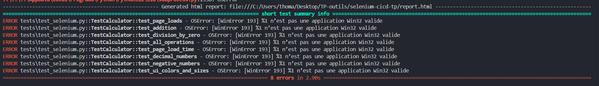

Erreur d'indentaation après le copy paste du code python pour le test_selenium.py
Corrigé

Rapport d'analyse de l'étape 2.3

Erreur de l'environnement Selenium/ChromeDriver

Rapport d'analyse de l'étape 4.2

Erreur de l'environnement toujours mais une erreur de plus avec le nouveau test ajouté dans le test_selenium.py

Rapport d'erreur de l'étape 5.1

### 1) Avantages observes
- L'automatisation des tests permet de detecter rapidement les regressions apres chaque modification.
- Les scenarios repetitifs (operations de calcul, cas limites, verification UI) sont rejoues de facon fiable.
- Le CI/CD ameliore la qualite du code en executant les tests automatiquement a chaque push/PR, ce qui evite de merger du code non verifie.
- Les rapports (`report.html`) rendent les erreurs visibles et tracables pour l'equipe.

### 2) Defis rencontres
- Principale difficulte: configuration Selenium/WebDriver sur Windows (`WinError 193`), qui bloque les tests avant execution des assertions.
- Difficulte secondaire: erreurs d'indentation et d'encodage lors du copier-coller du code depuis le PDF.
- Pour ameliorer la stabilite des tests:
  - verrouiller les versions navigateur/driver,
  - stabiliser les chemins de fichiers et l'environnement d'execution (local/CI),
  - garder des attentes explicites (`WebDriverWait`) et limiter les `sleep`,
  - isoler la logique Selenium avec le pattern Page Object pour faciliter la maintenance.
